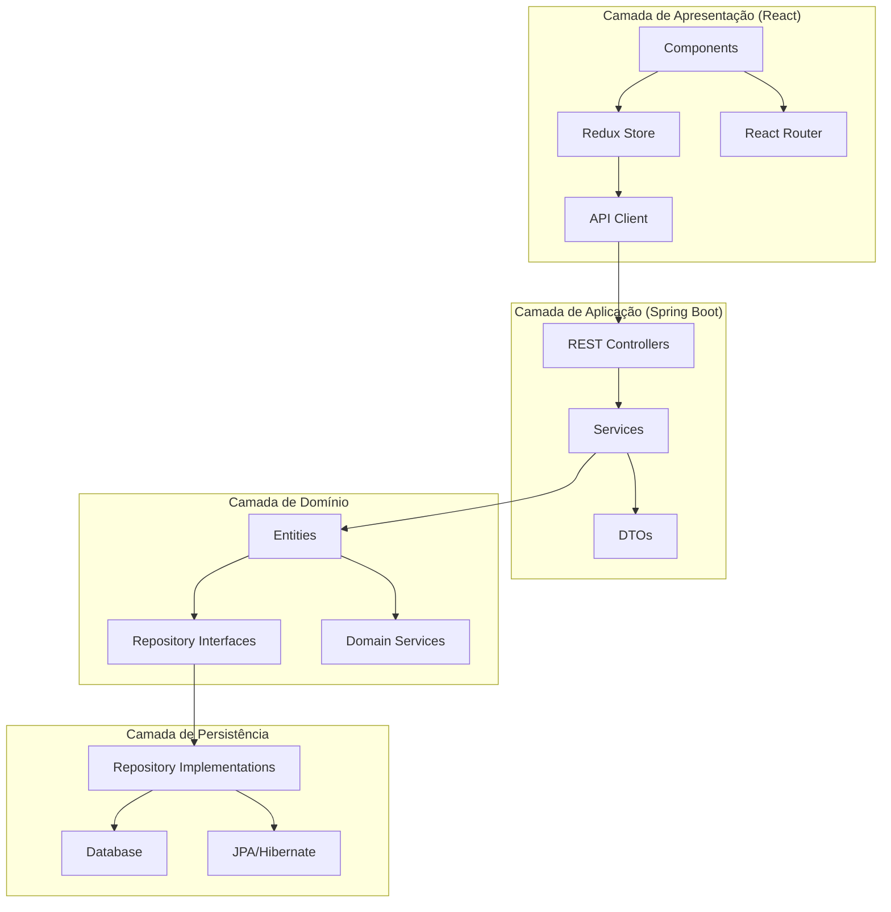

```mermaid
graph TD
    subgraph "Camada de Apresentação (React)"
        A1[Components] --> A2[Redux Store]
        A2 --> A3[API Client]
        A1 --> A4[React Router]
    end

    subgraph "Camada de Aplicação (Spring Boot)"
        B1[REST Controllers] --> B2[Services]
        B2 --> B3[DTOs]
    end

    subgraph "Camada de Domínio"
        C1[Entities] --> C2[Repository Interfaces]
        C1 --> C3[Domain Services]
    end

    subgraph "Camada de Persistência"
        D1[Repository Implementations] --> D2[Database]
        D1 --> D3[JPA/Hibernate]
    end

    A3 --> B1
    B2 --> C1
    C2 --> D1
```